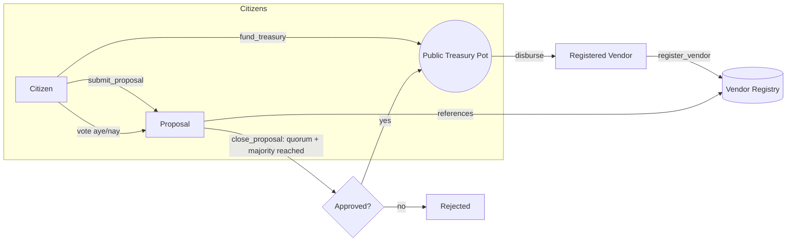

# VendorDAO

**VendorDAO** is a blockchain application for **open, transparent, citywide vendor funding**,
powered by [Polkadot](https://polkadot.com/) and the [Polkadot SDK](https://polkadot.com/platform/sdk/)
(Substrate/FRAME). Citizens vote on funding proposals submitted on behalf of vendors; approved
proposals are paid automatically from a public, on-chain treasury. Every vote, proposal, and
disbursement is a public, auditable chain event — there is no back office. The web app is
multilingual, with on-demand machine translation for user-submitted content.

## How it works



1. Anyone can register as a **vendor** (`register_vendor`). A privileged admin origin (the city)
   can mark a vendor **verified** as a trust signal, without blocking open registration.
2. Anyone can contribute to the public **treasury pot** (`fund_treasury`) — a sovereign on-chain
   account with a fully queryable balance, plus running `TotalFundsReceived` /
   `TotalFundsDisbursed` counters: a transparent funding ledger.
3. Any signed account can **submit a proposal** on behalf of a registered vendor, requesting an
   amount of funds for a described piece of civic work.
4. Citizens **vote** aye/nay, one account = one vote. Every vote is public, on-chain storage.
5. Once voting ends, **anyone** can trigger tallying. If the proposal reached quorum and a simple
   majority, it's approved and funds move from the pot to the vendor automatically — no manual
   payout step, no intermediary.

See [`chain/pallets/vendor-dao`](chain/pallets/vendor-dao/src/lib.rs) for the full pallet
implementation (extrinsics, storage, events) and its unit tests.

## Repository layout

```
VendorDAO/
├── chain/       Polkadot SDK solochain (Rust) — the vendor-dao-node binary + custom pallet
└── frontend/    Next.js dApp — dashboard, proposals, vendor registry, wallet connect, i18n
```

## Quickstart

### 1. Run the chain

```sh
cd chain
cargo build --release
./target/release/vendor-dao-node --dev
```

See [`chain/README.md`](chain/README.md) for the pallet's extrinsics/storage reference and
**Windows-specific build notes** (protoc, LLVM, and a WASM linker workaround needed in some
toolchain setups).

### 2. Run the frontend

```sh
cd frontend
cp .env.local.example .env.local   # then fill in GOOGLE_TRANSLATE_API_KEY if you want translation
npm install
npm run dev
```

Open [http://localhost:3000](http://localhost:3000). Install the
[polkadot{.js} browser extension](https://polkadot.js.org/extension/) (or Talisman/SubWallet) and
create/import a `--dev` account (e.g. Alice) to submit proposals, vote, and fund the treasury.

See [`frontend/README.md`](frontend/README.md) for more detail.

## Multilingual & translation

The UI ships with static translations (English, Spanish, French, Arabic — including RTL layout,
Chinese, Hindi) via `react-i18next`. Since proposal titles/descriptions are arbitrary user-submitted
text that can't be pre-translated, the frontend also calls a server-side `/api/translate` route
backed by the **Google Cloud Translation API** on demand. The API key is read from a server-only
environment variable and is never exposed to the browser; the translation provider is an isolated,
swappable module (see [`frontend/README.md`](frontend/README.md#swapping-the-translation-provider))
so Azure Translator, DeepL, or LibreTranslate can be substituted without touching client code.

## Security notes

- The Google Translate API key lives only in `GOOGLE_TRANSLATE_API_KEY` (server-side env var) and
  is proxied through `/api/translate`; it is never shipped to client-side JavaScript.
- Vendor registration requires verifying a real email address first (self-hosted math CAPTCHA +
  6-digit email code, see `frontend/src/lib/server/`). Verification tokens are signed with
  `VENDOR_VERIFICATION_SECRET` (set a real random value in production); outgoing email is sent via
  SMTP if `SMTP_HOST` is configured, otherwise the code is returned directly for local testing.
- All chain state mutations (voting, proposing, registering, funding) are signed extrinsics
  submitted through the user's own wallet extension — the app never handles private keys.
- Dispatch errors from the chain are decoded into readable `pallet.ErrorName` messages instead of
  opaque codes, so users always see *why* an action failed.

## Known environment limitations

This was developed/validated in a sandboxed Windows environment without administrator rights:

- `cargo test -p pallet-vendor-dao` (15/15 passing) and `cargo check -p vendor-dao-runtime` are
  used to validate the pallet and its runtime wiring — this covers all FRAME macro expansion,
  trait bounds, and governance logic, and is far faster than a full node rebuild.
- Building the **full node** (`cargo build --release` in `chain/`) additionally needs protoc,
  the `wasm32-unknown-unknown` target, and LLVM/libclang for `librocksdb-sys`. See
  `chain/README.md` for the Windows-specific setup (including an admin-rights-free way to obtain
  libclang, and a WASM-linker workaround some toolchain/Rust version combinations need).

## License

This repository is MIT licensed (see [`LICENSE`](LICENSE)). `chain/` additionally retains the
Unlicense (public domain) grant inherited from the upstream Polkadot SDK solochain template — see
[`chain/LICENSE`](chain/LICENSE).
